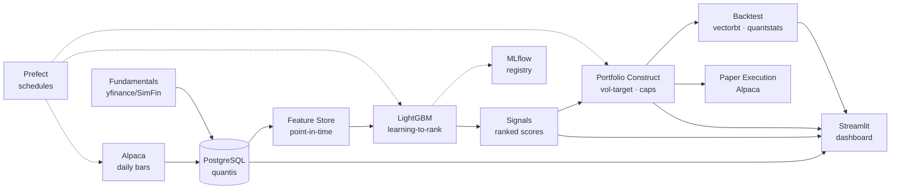

<div align="center">

# 📈 Quantis

### Cross-Sectional Equity ML Trading System

*A production-shaped, machine-learning long/short strategy on US large-caps — from data ingestion to paper execution.*

[](https://www.python.org/)
[](https://github.com/astral-sh/uv)
[](https://www.postgresql.org/)
[](https://lightgbm.readthedocs.io/)
[](https://www.prefect.io/)
[](https://streamlit.io/)
[]()
[](LICENSE)

</div>

---

## Overview

**Quantis** ranks the S&P 500 each week with a gradient-boosted **learning-to-rank** model
that predicts forward *cross-sectional excess return*. It goes **long the top quintile and
short the bottom quintile**, sized by a risk model (volatility targeting, sector and
single-name caps), and rebalances weekly — reporting results **net of realistic transaction
costs**. Horizon is daily/weekly; **no intraday**.

It is built as a complete, honest quant workflow rather than a notebook: point-in-time data,
leakage-safe cross-validation, cost-aware backtesting, an MLOps loop, and paper execution
through the same broker that supplies the data.

> **Disclaimer** — Educational / portfolio project. **Paper trading only**, no real orders.
> Nothing here is investment advice. Figures in the UI mockups are illustrative.

---

## What this project demonstrates

| Theme | How it shows up |
|---|---|
| **Point-in-time correctness** | Universe & fundamentals stamped with `as_of` dates; features use only data available at prediction time. |
| **Leakage-safe validation** | Purged K-fold cross-validation with an embargo so overlapping forward-return labels can't leak across folds. |
| **Cross-sectional learning-to-rank** | Labels are per-date z-scored forward returns — the model learns *relative* strength, neutralizing market beta. |
| **Cost-aware backtesting** | Commission + slippage + turnover penalties; only net-of-cost metrics are reported. |
| **Risk-managed construction** | Vol-targeting with per-name and per-sector caps behind a single `portfolio.construct()` seam. |
| **MLOps** | MLflow experiment tracking + model registry, Prefect-scheduled retrain, and drift / IC-decay monitoring. |
| **Reinforcement learning** *(advanced)* | Optional PPO/SAC portfolio-construction agent, benchmarked honestly against the rule-based baseline. |

---

## Architecture



---

## Tech stack

| Layer | Tools |
|---|---|
| **Language / env** | Python 3.11, [uv](https://github.com/astral-sh/uv) (no Docker) |
| **Data & storage** | Alpaca Market Data, yfinance, PostgreSQL, SQLAlchemy 2.0, Alembic |
| **Modeling** | scikit-learn, LightGBM, XGBoost, SHAP, MLflow |
| **Backtesting** | vectorbt, quantstats |
| **Orchestration** | Prefect (isolated profile) |
| **Execution** | Alpaca paper trading |
| **Dashboard** | Streamlit + Plotly |
| **Quality** | pytest, ruff, mypy, pre-commit, GitHub Actions |

---

## Data

Self-contained by design. **Daily**, split/dividend-adjusted OHLC bars are pulled from
**Alpaca** into this project's own `quantis` PostgreSQL database — there is no runtime
dependency on any other project.

**Currently loaded:** ~757k daily bars · **502 symbols** · **2017-11 → 2026-09** (~7 years).

> *Known limitations:* the free **IEX feed** reports IEX-only volume (consistent across
> names, so cross-sectional features are unaffected) and history begins in late 2017;
> the starter universe is the *current* S&P 500 (survivorship bias). Both are documented
> and addressable.

---

## Quickstart

```bash
# 1. Environment (uv fetches Python 3.11 automatically)
uv python install 3.11
uv sync --group data --group ml --group backtest --group orchestration --group app

# 2. Configure
cp .env.example .env          # fill PGPASSWORD and Alpaca paper keys

# 3. Create the dedicated database, then validate the environment
uv run python scripts/init_db.py
uv run python scripts/env_check.py    # imports + Postgres ping → "ENV GATE: PASS"

# 4. Ingest daily bars for the S&P 500
uv run python -m quantis.orchestration.flows

# 5. Orchestration UI (isolated Prefect server on :4201)
./scripts/prefect_server.ps1
```

The reinforcement-learning module is optional and pulls PyTorch: `uv sync --group rl`.

---

## Dashboard

A dark **quant-terminal** UI with five screens — Overview / P&L, Signals, Positions & Risk,
Model Diagnostics, and Pipeline Monitoring. High-fidelity mockups live in [`design/`](design/)
and the Streamlit build targets them screen-for-screen.

---

## Project structure

```
src/quantis/
├── config.py          # pydantic settings from .env (absolute-path loaded)
├── db/                # SQLAlchemy models + engine/session
├── data/              # universe, Alpaca/yfinance price sources, upsert store
├── features/          # point-in-time feature store
├── models/            # labels, purged CV, LightGBM training, registry
├── backtest/          # vectorbt engine, costs, metrics
├── portfolio/         # construct() → weights, risk model, constraints
├── rl/                # (advanced) Gymnasium env + PPO/SAC agent
├── execution/         # SimulatedBroker + Alpaca paper adapter
└── orchestration/     # Prefect flows
dashboard/             # Streamlit app (5 screens)
scripts/               # env_check, init_db, prefect_server
tests/                 # env / feature / leakage / backtest tests
design/                # dark quant-terminal UI mockups
docs/PLAN.md           # full design & build plan
```

---

## Roadmap

- [x] **Phase 0–1** — Repo, uv env (Python 3.11), config, DB, environment gate
- [x] **Phase 2** — Data layer: schema, S&P 500 universe, Alpaca daily bars, Prefect ingest
- [ ] **Phase 3** — Point-in-time feature store (momentum, value, quality, volatility, technical)
- [ ] **Phase 4** — Labels + LightGBM with purged CV, MLflow tracking, SHAP
- [ ] **Phase 5** — vectorbt cost-aware backtest + quantstats tearsheet
- [ ] **Phase 6** — Portfolio construction & risk model
- [ ] **Phase 7** — Paper execution (Alpaca) behind a common interface
- [ ] **Phase 8** — Prefect deployments (ingest / retrain / rebalance)
- [ ] **Phase 9** — Streamlit dashboard
- [ ] **Phase 10** — RL portfolio agent (advanced)
- [ ] **Phase 11** — CI, tearsheet, polish

See [`docs/PLAN.md`](docs/PLAN.md) for the full design rationale.

---

## License

MIT — see [`LICENSE`](LICENSE).
