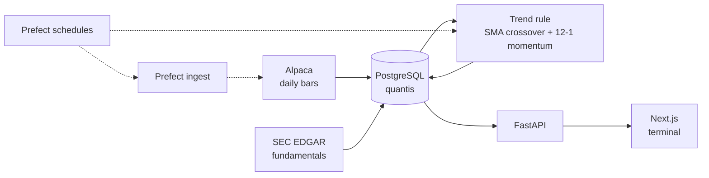

<div align="center">

# 📈 Quantis

### US Equity Data Platform + Rule-Based Trend Signal

*Alpaca daily bars → PostgreSQL → SMA-crossover / momentum trend rule → FastAPI / Next.js.*

[](https://github.com/nishantnayar/trading-public/actions/workflows/ci.yml)
[](https://www.python.org/)
[](https://github.com/astral-sh/uv)
[](https://www.postgresql.org/)
[](https://www.prefect.io/)
[](https://fastapi.tiangolo.com/)
[](https://nextjs.org/)
[](LICENSE)

</div>

---

## Overview

**Quantis** ingests daily equity bars and quarterly fundamentals into a local PostgreSQL
database, and evaluates a fully mechanical, backtestable trend-following rule (SMA
crossover confirmed by 12-1 momentum, debounced exit) over the full active universe. A
FastAPI backend and Next.js terminal surface data coverage, the current signal per
symbol, and pipeline status.

> **Disclaimer** — Educational / portfolio project. **Paper trading only**, no real orders.
> Nothing here is investment advice.

This repo previously carried a full LightGBM cross-sectional ranking pipeline
(features → model → backtest → paper execution). That layer was removed to rebuild the
signal side from a simpler, fully-rule-based baseline first — see
[`docs/PROGRESS.md`](docs/PROGRESS.md) for what that pipeline covered and why it was cut.

---

## What is built

| Layer | What you can run today |
|---|---|
| **Prices** | ~758k Alpaca daily bars, 503 symbols, upserted into Postgres |
| **Fundamentals** | Quarterly reports from SEC EDGAR, point-in-time `as_of` dates, 503 symbols back to 2006 |
| **Signal** | Rule-based trend-follower (`quantis.signals`) over the full ~503-name active universe — SMA(50/200) crossover, 12-1 momentum filter, 3-day debounced exit |
| **Backtest** | Vectorized long/flat backtest + a 3-variant debounce comparison, no costs modeled |
| **Ingest / schedules** | Prefect server + cron runner on `scripts/start.py` (weekday bar ingest, then signal recompute) |
| **API / UI** | FastAPI `:8000` + Next.js `:3000` — Overview, Signals, Positions, Monitoring |

The **Model** screen (a holdover from the deleted ML pipeline) has been removed from
the UI — there is currently no model in this system to show diagnostics for.

Backtested over its full history (2020-07-27 → today) across the full ~503-name active
universe, with a 10 bps/side cost model: the current default rule (single-bar entry,
3-day debounced exit) is the best of the three debounce variants tested — most wins
(251/503), least-negative median net return, and the only one with a (barely) positive
median Sharpe (0.04) — but median **net** return is negative for all three variants
tested (-4.7% for the default, vs -19.0% and -6.1% for the other two). Read this
honestly: a rule this simple having no edge, net of costs, across the broad market is
the expected result, not a bug — see `uv run python -m quantis.signals --compare` and
[`src/quantis/signals/rules.py`](src/quantis/signals/rules.py) for the full rationale.

---

## Architecture (current)



---

## Stack

| Layer | Tools |
|---|---|
| **Language / env** | Python 3.11, [uv](https://github.com/astral-sh/uv) (no Docker) |
| **Data & storage** | Alpaca Market Data, SEC EDGAR (fundamentals), PostgreSQL, SQLAlchemy 2.0 |
| **Signal** | Pure pandas (`quantis.signals`) — no ML dependency today |
| **Orchestration** | Prefect (isolated local profile) |
| **Backend / UI** | FastAPI + Uvicorn, Next.js (React + TypeScript) + Tailwind |
| **Quality** | pytest, black, flake8, ruff, mypy, pre-commit, GitHub Actions |

---

## Quickstart

```bash
# 1. Environment (uv fetches Python 3.11 automatically)
uv python install 3.11
uv sync --group data --group orchestration --group api --group app --group dev

# 2. Configure
cp .env.example .env          # fill PGPASSWORD and Alpaca paper keys

# 3. Create the dedicated database, then validate the environment
uv run python scripts/init_db.py
uv run python scripts/env_check.py    # imports + Postgres ping → "ENV GATE: PASS"

# 4. Ingest daily bars for the S&P 500
uv run python -m quantis.orchestration.flows

# 4b. Fundamentals from SEC EDGAR (full universe by default, ~5 min; one-time)
uv run python scripts/ingest_fundamentals_edgar.py

# 4c. Compute and persist the trend signal over the full active universe
uv run python -m quantis.signals --persist

# Optional: backtest the rule, or compare debounce variants
uv run python -m quantis.signals --backtest
uv run python -m quantis.signals --compare

# 5. Local stack: FastAPI :8000, Next.js :3000, Prefect :4201 + cron deployments
uv run python scripts/start.py
```

One terminal, interleaved `[api]` / `[ui]` / `[prefect]` / `[schedules]` logs, Ctrl+C
stops everything. Use `--only api ui` or `--skip prefect` for a subset. `--skip schedules`
keeps the Prefect UI without registering cron. Postgres should already be running as a
system service.

Frontend deps: `cd frontend && npm install` (first time only; the launcher warns if
`node_modules` is missing).

---

## Quality checks

Lint and type checks run **before each commit** (pre-commit) and again on **GitHub Actions**
for every push and pull request.

```bash
uv sync --group dev                 # black, flake8, ruff, mypy, pre-commit
uv run pre-commit install           # once per clone — blocks bad commits
uv run pre-commit run --all-files   # same suite locally
```

| Check | What it covers |
|---|---|
| **black** | Python formatting (100-char lines) |
| **flake8** | pycodestyle + pyflakes |
| **ruff** | flake8-equivalent rules plus isort, pyupgrade, bugbear |
| **mypy** | static types on `src/`, `tests/`, `scripts/` |
| **ESLint** | Next.js / TypeScript in `frontend/` |
| **pytest** | unit suite (CI; DB ping skips without `PGPASSWORD`) |

CI also runs `npm run lint` in `frontend/`.

---

## Dashboard

```bash
uv run python scripts/start.py
# API      http://127.0.0.1:8000/docs
# UI       http://localhost:3000
# Prefect  http://127.0.0.1:4201   (deployments register with the stack)
```

| Screen | Source |
|---|---|
| Overview `/` | Live — coverage, universe, sector mix, price chart |
| Monitoring `/monitoring` | Live — bar coverage, ingest-run audit |
| Signals `/signals` | Live — current trend rule signal per universe symbol |
| Positions `/positions` | Live — equal-weighted illustrative book of currently-long names |

See [`frontend/README.md`](frontend/README.md).

---

## Project structure

```
src/quantis/
├── config.py          # pydantic settings from .env
├── db/                # SQLAlchemy models + engine/session
├── data/              # universe, Alpaca/EDGAR sources, upsert store
├── signals/           # rule-based trend signal: indicators, rules, engine, backtest
├── orchestration/      # Prefect ingest + signal-recompute flows (with start.py)
└── api/               # FastAPI backend
frontend/              # Next.js dashboard
scripts/               # start.py, env_check, init_db, ingest_fundamentals_edgar
tests/                 # env, signals, orchestration, API
docs/                  # PLAN · PROGRESS · LIMITATIONS
```

---

## Docs

How to run this repo is above. Everything else is under [`docs/`](docs/README.md):

- [`docs/PLAN.md`](docs/PLAN.md) — design and remaining phases
- [`docs/PROGRESS.md`](docs/PROGRESS.md) — what is verified (counts, tests, metrics)
- [`docs/LIMITATIONS.md`](docs/LIMITATIONS.md) — data and model caveats

---

## License

MIT — see [`LICENSE`](LICENSE).
