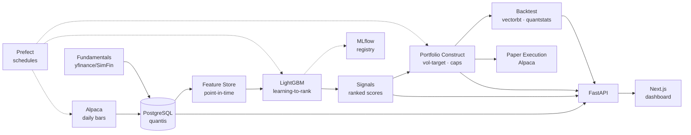

<div align="center">

# 📈 Quantis

### Cross-Sectional Equity ML Trading System

*A production-shaped, machine-learning long/short strategy on US large-caps — from data ingestion to paper execution.*

[](https://www.python.org/)
[](https://github.com/astral-sh/uv)
[](https://www.postgresql.org/)
[](https://lightgbm.readthedocs.io/)
[](https://www.prefect.io/)
[](https://fastapi.tiangolo.com/)
[](https://nextjs.org/)
[]()
[](LICENSE)

</div>

---

## Overview

**Quantis** ranks the S&P 500 each week with a gradient-boosted **learning-to-rank** model
that predicts forward *cross-sectional excess return*. It goes **long the top quintile and
short the bottom quintile**, sized by a risk model (volatility targeting, sector and
single-name caps), and rebalances weekly — reporting results **net of realistic transaction
costs**. Horizon is daily/weekly; **no intraday**.

It is built as a complete, honest quant workflow rather than a notebook: point-in-time data,
leakage-safe cross-validation, cost-aware backtesting, an MLOps loop, and paper execution
through the same broker that supplies the data.

> **Disclaimer** — Educational / portfolio project. **Paper trading only**, no real orders.
> Nothing here is investment advice. Figures in the UI mockups are illustrative.

---

## What this project demonstrates

| Theme | How it shows up |
|---|---|
| **Point-in-time correctness** | Universe & fundamentals stamped with `as_of` dates; features use only data available at prediction time. |
| **Leakage-safe validation** | Purged K-fold cross-validation with an embargo so overlapping forward-return labels can't leak across folds. |
| **Cross-sectional learning-to-rank** | Labels are per-date z-scored forward returns — the model learns *relative* strength, neutralizing market beta. |
| **Cost-aware backtesting** | Commission + slippage + turnover penalties; only net-of-cost metrics are reported. |
| **Risk-managed construction** | Vol-targeting with per-name and per-sector caps behind a single `portfolio.construct()` seam. |
| **MLOps** | MLflow experiment tracking + model registry, Prefect-scheduled retrain, and drift / IC-decay monitoring. |
| **Docs as engineering** | Markdown in `docs/` now; **Sphinx autodoc** from package docstrings at Phase 11. |
| **Reinforcement learning** *(advanced)* | Optional PPO/SAC portfolio-construction agent, benchmarked honestly against the rule-based baseline. |

---

## Architecture



---

## Tech stack

| Layer | Tools |
|---|---|
| **Language / env** | Python 3.11, [uv](https://github.com/astral-sh/uv) (no Docker) |
| **Data & storage** | Alpaca Market Data, yfinance, PostgreSQL, SQLAlchemy 2.0, Alembic |
| **Modeling** | scikit-learn, LightGBM, XGBoost, SHAP, MLflow |
| **Backtesting** | vectorbt, quantstats |
| **Orchestration** | Prefect (isolated profile) |
| **Execution** | Alpaca paper trading |
| **Backend API** | FastAPI + Uvicorn |
| **Dashboard** | Next.js (React + TypeScript) + Tailwind *(Streamlit smoke test interim)* |
| **Quality** | pytest, ruff, mypy, pre-commit, GitHub Actions |

---

## Data

Self-contained by design. **Daily**, split/dividend-adjusted OHLC bars are pulled from
**Alpaca** into this project's own `quantis` PostgreSQL database — there is no runtime
dependency on any other project.

**Currently loaded:** ~757k daily bars · **502 symbols**. The earliest row is dated
2017-11, but that is a *single* name — the universe is only populated from **2020**, so
the usable cross-sectional span is **~6.5 years**.

**Feature store:** ~755k rows · 502 symbols · **11 price-only features**, all
point-in-time. Momentum, short-term reversal, realised vol, RSI,
distance-from-52w-high, 50/200 MA ratio, and IEX dollar-volume — all point-in-time,
with leakage tests. Value/quality features are deferred until fundamentals have real
history.

**Fundamentals: pilot only** — 5 symbols, 25 quarterly rows. yfinance exposes just ~5
usable quarters per ticker, so value/quality features are blocked on a better source and
the remaining ~497 symbols are **not** yet backfilled.

**Model:** LightGBM regression on per-date z-scored 5-day forward returns, evaluated
under purged walk-forward CV (11-session train/validation gap every fold). Over 5 folds
on a 489k-row panel: **rank IC 0.0178** (t-stat 3.97, 915 dates), ICIR 0.13, 56% IC hit
rate. `vol_60d` and `mom_12_1` dominate SHAP importance.

> *That number is deliberately unimpressive.* It is **gross of all costs** and measured
> on z-scored labels, so the quintile spread is in sigma, not percent — whether any of it
> survives transaction costs is Phase 5's question. An IC of 0.30 on free daily bars
> would mean a leak, not alpha; a shuffled-label control test confirms this one isn't.
> Requiring complete feature vectors also drops 35% of rows and moves the training window
> start to **2021-07**, and fold 1 is negative purely because the cross-section is still
> filling in. Details in [`docs/LIMITATIONS.md`](docs/LIMITATIONS.md#model-phase-4).

> *Known limitations:* the free **IEX feed** reports IEX-only volume (consistent across
> names, so cross-sectional features are unaffected); the cross-section only starts in
> **2020**, so no pre-COVID regimes are in the training window; the starter universe is
> the *current* S&P 500 (survivorship bias); fundamentals have ~1 year of history and an
> approximated `as_of` filing date.
>
> **See [`docs/LIMITATIONS.md`](docs/LIMITATIONS.md)** for the full accounting, including
> the pending full-universe fundamentals backfill.

---

## Quickstart

```bash
# 1. Environment (uv fetches Python 3.11 automatically)
uv python install 3.11
uv sync --group data --group ml --group backtest --group orchestration --group api --group app

# 2. Configure
cp .env.example .env          # fill PGPASSWORD and Alpaca paper keys

# 3. Create the dedicated database, then validate the environment
uv run python scripts/init_db.py
uv run python scripts/env_check.py    # imports + Postgres ping → "ENV GATE: PASS"

# 4. Ingest daily bars for the S&P 500
uv run python -m quantis.orchestration.flows

# 4b. Fundamentals (pilot = 5 names; `--all` for the full universe, see LIMITATIONS.md)
uv run python scripts/ingest_fundamentals.py

# 4c. Point-in-time price features (writes the `features` table)
uv run python -m quantis.features.build

# 5. Local stack: FastAPI :8000, Next.js :3000, Prefect :4201
uv run python scripts/start.py          # ./scripts/start.ps1 is a shim for this
```

One terminal, interleaved `[api]` / `[ui]` / `[prefect]` logs, Ctrl+C stops everything.
Use `--only api ui` or `--skip prefect` to run a subset. Postgres is expected to already
be running as a system service.

The reinforcement-learning module is optional and pulls PyTorch: `uv sync --group rl`.
Frontend deps: `cd frontend && npm install` (first time only; the launcher warns if the
`node_modules` folder is missing).

---

## Dashboard

A dark **quant-terminal** with five screens — Overview, Signals, Positions, Model, and
Monitoring. Mockups live in [`design/`](design/). The **Next.js** app consumes a **FastAPI**
backend; Overview and Monitoring are live against Postgres. Signals / Positions / Model
still show labeled mockup figures until Phases 4–7 land.

```bash
uv run python scripts/start.py
# API      http://127.0.0.1:8000/docs
# UI       http://localhost:3000
# Prefect  http://127.0.0.1:4201
```

A Streamlit smoke test remains at `./scripts/dashboard.ps1` (`:8502`) until the Next.js
screens fully replace it. See [`frontend/README.md`](frontend/README.md).

---

## Project structure

```
src/quantis/
├── config.py          # pydantic settings from .env (absolute-path loaded)
├── db/                # SQLAlchemy models + engine/session
├── data/              # universe, Alpaca/yfinance price sources, upsert store
├── features/          # point-in-time feature store
├── models/            # labels, purged CV, LightGBM training, registry
├── backtest/          # vectorbt engine, costs, metrics
├── portfolio/         # construct() → weights, risk model, constraints
├── rl/                # (advanced) Gymnasium env + PPO/SAC agent
├── execution/         # SimulatedBroker + Alpaca paper adapter
├── orchestration/     # Prefect flows
└── api/               # FastAPI backend (JSON for the Next.js UI)
frontend/              # Next.js (React + TS) dashboard — 5 screens
dashboard/             # Streamlit smoke test (temporary)
scripts/               # start.py (launcher), env_check, init_db, ingest_fundamentals
tests/                 # env / feature / leakage / API / fundamentals
design/                # dark quant-terminal UI mockups
docs/                  # PLAN · PROGRESS · LIMITATIONS
```

---

## Roadmap

- [x] **Phase 0–1** — Repo, uv env (Python 3.11), config, DB, environment gate
- [x] **Phase 2** — Data layer: schema, S&P 500 universe, Alpaca daily bars, Prefect ingest
- [~] **Phase 2b** — Fundamentals: schema + yfinance loader done, **5-symbol pilot only**
      ([full backfill pending](docs/LIMITATIONS.md#3-todo--full-universe-backfill))
- [x] **Phase 3** — Point-in-time **price-only** feature store + leakage tests
      (value/quality deferred — [LIMITATIONS](docs/LIMITATIONS.md))
- [x] **Phase 4** — Labels + LightGBM, purged walk-forward CV, MLflow, SHAP
      (rank IC **0.018** gross, 5 folds — [read the caveats](docs/LIMITATIONS.md#model-phase-4))
- [ ] **Phase 5** — vectorbt cost-aware backtest + quantstats tearsheet
- [ ] **Phase 6** — Portfolio construction & risk model
- [ ] **Phase 7** — Paper execution (Alpaca) behind a common interface
- [ ] **Phase 8** — Prefect deployments (ingest / retrain / rebalance)
- [~] **Phase 9** — FastAPI + Next.js dashboard (Overview/Monitoring live; other screens mock)
- [ ] **Phase 10** — RL portfolio agent (advanced)
- [ ] **Phase 11** — CI, tearsheet, polish, **Sphinx docs site** (autodoc from the package)

See [`docs/PLAN.md`](docs/PLAN.md) for the full design rationale.

---

## Documentation

The README is the landing page. Working notes live under [`docs/`](docs/README.md):

- [`docs/PLAN.md`](docs/PLAN.md) — design decisions and phase status
- [`docs/PROGRESS.md`](docs/PROGRESS.md) — what is built and verified, with evidence
- [`docs/LIMITATIONS.md`](docs/LIMITATIONS.md) — data caveats and deferred work
- [`frontend/README.md`](frontend/README.md) — dashboard runbook

**TODO (Phase 11):** a **Sphinx** site generated from package docstrings (`sphinx-apidoc` /
Napoleon) plus these markdown pages — API reference, architecture, and limitations as a
real docs build, not a recruiter-only README. Do not stand this up until the model,
backtest, and portfolio layers exist, or the generated pages will be empty stubs.

---

## License

MIT — see [`LICENSE`](LICENSE).
