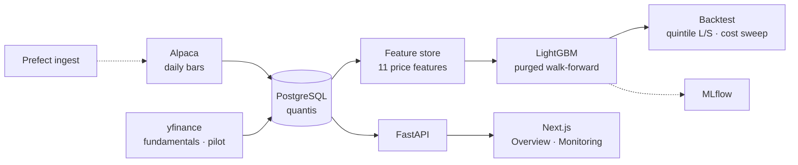

<div align="center">

# 📈 Quantis

### Cross-Sectional Equity ML Trading System

*Daily S&P 500 ranking: Alpaca bars → point-in-time features → LightGBM → FastAPI / Next.js.*

[](https://github.com/nishantnayar/trading-public/actions/workflows/ci.yml)
[](https://www.python.org/)
[](https://github.com/astral-sh/uv)
[](https://www.postgresql.org/)
[](https://lightgbm.readthedocs.io/)
[](https://www.prefect.io/)
[](https://fastapi.tiangolo.com/)
[](https://nextjs.org/)
[](LICENSE)

</div>

---

## Overview

**Quantis** trains a LightGBM model to rank the S&P 500 on **forward cross-sectional
excess return** (per-date z-scored 5-day returns). Data, features, and the model live in
a local PostgreSQL database; a FastAPI backend and Next.js terminal surface coverage,
prices, and pipeline status.

> **Disclaimer** — Educational / portfolio project. **Paper trading only**, no real orders.
> Nothing here is investment advice.

---

## What is built

| Layer | What you can run today |
|---|---|
| **Prices** | ~757k Alpaca daily bars, 502 symbols, upserted into Postgres |
| **Features** | 11 point-in-time price features (~755k rows) with leakage tests |
| **Model** | LightGBM + purged walk-forward CV, MLflow tracking, SHAP |
| **Backtest** | Dollar-neutral quintile L/S, cost sweep, Phase 6 construction levers |
| **Ingest** | Prefect `ingest-daily-bars` under an isolated local profile (`:4201`) |
| **API / UI** | FastAPI `:8000` + Next.js `:3000` — Overview and Monitoring are live |

**Result so far — a real signal that costs eat.** Out-of-fold rank IC **0.018**; the
long/short book returns **5.3% CAGR at Sharpe 0.78 gross**, but **1.7% at Sharpe 0.28**
once 10 bps per side is charged, and turns negative by 20 bps. Break-even is **15.7 bps
per side**, and the constraint is **34x annualised turnover**, not the signal. A
no-trade buffer plus a 10-session hold cuts that to **13.4x** and lifts break-even to
**25.4 bps**; sector-neutralising the 5.3% IT tilt **destroys** the edge. Full
accounting: [`docs/LIMITATIONS.md`](docs/LIMITATIONS.md#backtest-phase-5).

Fundamentals exist as a **5-symbol yfinance pilot**. Signals, Positions, and Model
screens in the UI are labeled placeholders until scores and positions are wired up.

Verified counts, tests, and design intent: [`docs/PROGRESS.md`](docs/PROGRESS.md),
[`docs/PLAN.md`](docs/PLAN.md).

---

## Architecture (current)



---

## Stack

| Layer | Tools |
|---|---|
| **Language / env** | Python 3.11, [uv](https://github.com/astral-sh/uv) (no Docker) |
| **Data & storage** | Alpaca Market Data, yfinance, PostgreSQL, SQLAlchemy 2.0 |
| **Modeling** | scikit-learn, LightGBM, SHAP, MLflow |
| **Orchestration** | Prefect (isolated local profile) |
| **Backend / UI** | FastAPI + Uvicorn, Next.js (React + TypeScript) + Tailwind |
| **Quality** | pytest, black, flake8, ruff, mypy, pre-commit, GitHub Actions |

---

## Quickstart

```bash
# 1. Environment (uv fetches Python 3.11 automatically)
uv python install 3.11
uv sync --group data --group ml --group backtest --group orchestration --group api --group app --group dev

# 2. Configure
cp .env.example .env          # fill PGPASSWORD and Alpaca paper keys

# 3. Create the dedicated database, then validate the environment
uv run python scripts/init_db.py
uv run python scripts/env_check.py    # imports + Postgres ping → "ENV GATE: PASS"

# 4. Ingest daily bars for the S&P 500
uv run python -m quantis.orchestration.flows

# 4b. Fundamentals (defaults to 5 names; pass --all for the full universe)
uv run python scripts/ingest_fundamentals.py

# 4c. Point-in-time price features (writes the `features` table)
uv run python -m quantis.features.build

# 4d. Train LightGBM (purged walk-forward; writes models/artifacts/)
uv run python -m quantis.models.train

# 4e. Backtest the out-of-fold predictions, net of costs
uv run python -m quantis.backtest.run
uv run python -m quantis.backtest.compare   # Phase 6 levers at 10 bps

# 5. Local stack: FastAPI :8000, Next.js :3000, Prefect :4201
uv run python scripts/start.py
```

One terminal, interleaved `[api]` / `[ui]` / `[prefect]` logs, Ctrl+C stops everything.
Use `--only api ui` or `--skip prefect` for a subset. Postgres should already be running
as a system service.

Optional RL extra (not used by the current pipeline): `uv sync --group rl`.
Frontend deps: `cd frontend && npm install` (first time only; the launcher warns if
`node_modules` is missing).

---

## Quality checks

Lint and type checks run **before each commit** (pre-commit) and again on **GitHub Actions**
for every push and pull request.

```bash
uv sync --group dev                 # black, flake8, ruff, mypy, pre-commit
uv run pre-commit install           # once per clone — blocks bad commits
uv run pre-commit run --all-files   # same suite locally
```

| Check | What it covers |
|---|---|
| **black** | Python formatting (100-char lines) |
| **flake8** | pycodestyle + pyflakes |
| **ruff** | flake8-equivalent rules plus isort, pyupgrade, bugbear |
| **mypy** | static types on `src/`, `tests/`, `scripts/` |
| **ESLint** | Next.js / TypeScript in `frontend/` |
| **pytest** | unit suite (CI; DB ping skips without `PGPASSWORD`) |

CI also runs `npm run lint` in `frontend/`. The RL extra (`torch`) is not installed in CI.

---

## Dashboard

```bash
uv run python scripts/start.py
# API      http://127.0.0.1:8000/docs
# UI       http://localhost:3000
# Prefect  http://127.0.0.1:4201
```

| Screen | Source |
|---|---|
| Overview `/` | Live — coverage, universe, sector mix, price chart |
| Monitoring `/monitoring` | Live — bar coverage |
| Signals / Positions / Model | Placeholders (labeled in the UI) |

See [`frontend/README.md`](frontend/README.md). A Streamlit data smoke test still runs
via `./scripts/dashboard.ps1` on `:8502`.

---

## Project structure

```
src/quantis/
├── config.py          # pydantic settings from .env
├── db/                # SQLAlchemy models + engine/session
├── data/              # universe, Alpaca/yfinance sources, upsert store
├── features/          # point-in-time feature store
├── models/            # labels, purged CV, LightGBM training, registry
├── backtest/          # weight construction, cost-aware P&L engine
├── orchestration/     # Prefect ingest flow
└── api/               # FastAPI backend
frontend/              # Next.js dashboard
scripts/               # start.py, env_check, init_db, ingest_fundamentals
tests/                 # env, features, leakage, labels, CV, backtest, API
docs/                  # PLAN · PROGRESS · LIMITATIONS
```

---

## Docs

How to run this repo is above. Everything else is under [`docs/`](docs/README.md):

- [`docs/PLAN.md`](docs/PLAN.md) — design and remaining phases
- [`docs/PROGRESS.md`](docs/PROGRESS.md) — what is verified (counts, tests, metrics)
- [`docs/LIMITATIONS.md`](docs/LIMITATIONS.md) — data and model caveats

---

## License

MIT — see [`LICENSE`](LICENSE).
